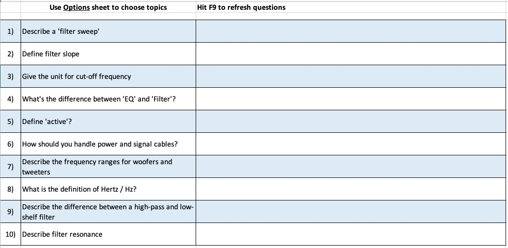

# Excel tools
{: .no_toc}

- TOC
{:toc}

## Retrieval Roulette

The roulette is a bank of questions used to automatically construct a random, low-stakes quiz. It supports retrieval practice and spaced repetition: questions from previous and current topics are mixed up randomly (at your control).

I read about Excel models in [Adam Boxer's blog](https://achemicalorthodoxy.wordpress.com/2018/08/18/retrieval-roulettes/). Links to many differente examples at the bottom. There is probably one for your subject.

My model is simple and flexible.

* The **Questions** sheet holds all the questions and answers
* The **Options** sheet selects which topics to include
* The following sheets ask questions in a number of ways, including
	* Leaving the answer blank or the question blank
	* Knowledge-organiser style, with different elements blanked out (less useful, but has prompted some imaginative responses in class)
	* A **Print Q** sheet designed to fill A4 paper for homework or a test

### Instructions

Written and video instructions to follow.

## MCQ Machine

The MCQ machine generates five multiple-choice questions from a list. You turn individual questions on or off in the **Questions** sheet and Excel will randomly choose five questions.

The answers, A to D, for each question are in a random order which changes each time.

### Instructions

1. Type a new question and up to four responses. Correct answer goes in final column. If not spelled identically, this will fail.
2. Type Y to include this question in the pool that may be randomly chosen.
3. You can leave rows blank or add headings to organise topics/weeks etc.
4. Select a number of the yellow cells, then press Ctrl+Enter to type 'Y' into many cells at once (for example to select questions for an entire topic).

Thoughts on writing [high-quality MCQs](https://testing.byu.edu/handbooks/14%20Rules%20for%20Writing%20Multiple-Choice%20Questions.pdf).
