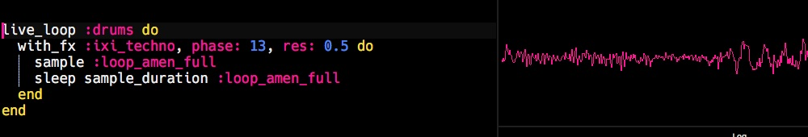

<!--

# Learning

* [Sonic Pi resources](http://ereed.gitbook.io)
* [View repo](https://github.com/MrReedSWCHS/mrreedswchs.github.io)

-->

<!--  -->

# Music Tech Induction 2020
* [Click here for Music Tech induction](induction2020/index.html)

<!--  -->

# Teaching

* [Sonic Pi Faculty workshop 2020](https://mrreedswchs.github.io/sonicpi2020/index.html)
	* [Handout](handout.html)

<!--
* [Faculty workshop, 2019](https://github.com/MrReedSWCHS/sonicpi-190619)
  * [Presentation](https://mrreedswchs.github.io/pres/pres.html)
-->

* Symbolic 8s grids
    * [8s](symbolic/symbolic8s.htm)
    * [8s, 2 rows](symbolic/symbolic8s_2.htm)
    * [5/4](symbolic/symbolic54.htm)